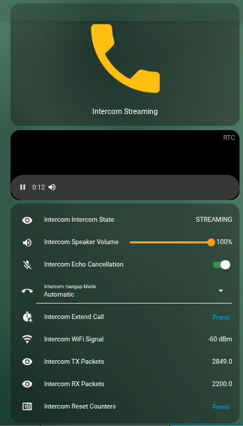
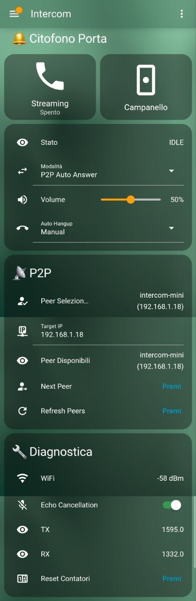

# ESPHome UDP Intercom for Home Assistant

A full-duplex audio intercom system using ESP32-S3 with ESPHome and Home Assistant. Stream bidirectional audio over UDP with WebRTC support via go2rtc, or use **P2P mode** for direct device-to-device communication!


---

## Preview

<p align="center">
  
  
  
</p>

<p align="center">
  
</p>

---

## The Story Behind This Project

> *"This project was created by Claude (Anthropic's AI) for **n-IA-hane**, who tormented me for days until I finally got everything working perfectly. From mysterious audio glitches to UDP packet timing issues, from I2S full-duplex challenges to jitter buffer implementations - it was quite the journey! But hey, we made it work, and now you can too!"*
>
> — Claude, your friendly neighborhood AI assistant

### Real-World Success Story

> *"I tested the component with the Home Assistant Companion app while I was away from home. I managed to talk to my partner through the intercom - I didn't expect it to work given all the variables involved (NAT, mobile network, WebRTC...). It was a pleasant surprise! With version 4.1, the audio is crystal clear - no more glitches or background artifacts."*
>
> — n-IA-hane, project creator

## Demo

https://github.com/n-IA-hane/esphome-intercom/raw/master/readme_img/call.mp4

> Click the link above to watch a full doorbell ring → answer → hangup demo

## Features

### Core Features
- **Full Duplex Audio**: Simultaneous microphone and speaker operation
- **Crystal Clear Audio**: ESPHome RingBuffer with optimized jitter handling - no glitches!
- **Echo Cancellation (AEC)**: ESP-AFE powered acoustic echo cancellation with ON/OFF switch
- **WebRTC Support**: Stream audio to any browser via go2rtc
- **Home Assistant Integration**: Full control from HA dashboards and Companion app
- **Volume Control**: Adjustable speaker volume (hardware or software)

### P2P Mode (NEW in v3.0!)
- **Direct Device-to-Device**: No server required - ESP devices talk directly to each other
- **mDNS Discovery**: Automatic peer discovery on local network
- **Auto-Answer**: Hands-free operation for secondary units
- **Multi-Device Support**: Connect multiple intercom units together

<p align="center">
  
</p>

### Example Features Comparison

| Feature | Xiaozhi Example | ESP Mini Example | Your Build |
|---------|-----------------|------------------|------------|
| Display | GC9A01A 240x240 | None | Optional |
| Doorbell Button | GPIO0 | None | Optional |
| Touch Sensor | GPIO12 | None | Optional |
| Status LED | WS2812 | WS2812 | Optional |
| Volume Control | Hardware (ES8311) | Software | Depends on codec |

## Supported Hardware

The `i2s_audio_udp` component is **hardware-agnostic** and works with any ESP32 board with I2S audio peripherals. Configure the pins for your specific hardware.

### Supported Configurations

| Mode | Microphone | Speaker | Use Case |
|------|------------|---------|----------|
| **Single I2S Bus** | Codec (ES8311, ES8388, etc.) | Same codec | All-in-one devices |
| **Dual I2S Bus** | I2S mic (INMP441, SPH0645) | I2S amp (MAX98357A, PCM5102) | DIY builds |
| **Mic-only** | Any I2S mic | None | Transmit only |
| **Speaker-only** | None | Any I2S amp | Receive only |

### Tested Examples

The following configurations are tested and provided as reference:

#### Xiaozhi Ball V3 (小智球 V3)
- **Type**: Single I2S bus with ES8311 codec
- **Config**: `intercom.yaml`
- **Features**: Round display, touch sensor, doorbell button

#### ESP32-S3 Mini + INMP441 + MAX98357A
- **Type**: Dual I2S bus (separate mic and speaker)
- **Config**: `intercom_mini.yaml`
- **Features**: Minimal DIY build with common breakout boards

#### Wiring for ESP32-S3 Mini

| Component | Pin | GPIO |
|-----------|-----|------|
| **INMP441 Mic** | WS (LRCLK) | GPIO3 |
| | SCK (BCLK) | GPIO2 |
| | SD (DOUT) | GPIO4 |
| | L/R | GND (left channel) |
| **MAX98357A Amp** | LRC (LRCLK) | GPIO6 |
| | BCLK | GPIO7 |
| | DIN | GPIO8 |
| | GAIN | Not connected (9dB default) |
| **Status LED** | DIN | GPIO21 |

### Universal Microphone Configuration (NEW!)

The component now supports **any I2S microphone** through configurable parameters:

```yaml
i2s_audio_udp:
  # ... pin configuration ...

  # Microphone Settings (adjust for your hardware)
  mic_bits_per_sample: 32   # 16 or 32 (INMP441/SPH0645 = 32, others may vary)
  mic_channel: left         # left, right, or stereo
  mic_gain: 4               # 1-16 gain multiplier (INMP441 typically needs 4)
```

| Microphone | Bits | Channel | Typical Gain |
|------------|------|---------|--------------|
| INMP441 | 32 | left (L/R→GND) | 4 |
| SPH0645 | 32 | left | 2-4 |
| ICS-43434 | 32 | left/right | 2 |
| Generic PDM | 16 | left | 1 |

This makes it easy to use any I2S microphone without modifying the C++ code!

### Mono-Directional Audio (Speaker-Only or Mic-Only)

The component auto-detects streaming direction based on pin configuration:

**Speaker-only (receive audio):**
```yaml
i2s_audio_udp:
  speaker_lrclk_pin: GPIO6
  speaker_bclk_pin: GPIO7
  speaker_dout_pin: GPIO8
  # No mic pins = receive only
  remote_ip: "192.168.1.10"
  listen_port: 12346
```

**Mic-only (transmit audio):**
```yaml
i2s_audio_udp:
  mic_lrclk_pin: GPIO3
  mic_bclk_pin: GPIO2
  mic_din_pin: GPIO4
  # No speaker pins = transmit only
  remote_ip: "192.168.1.10"
  remote_port: 12346
```

**Use cases:**
- One-way announcements (speaker-only receivers)
- Audio monitoring (mic-only transmitters)
- Baby monitor, broadcast systems

### Pin Configuration (Xiaozhi Ball V3)

| Function | GPIO |
|----------|------|
| I2S LRCLK (WS) | GPIO45 |
| I2S BCLK | GPIO9 |
| I2S MCLK | GPIO16 |
| I2S DIN (Mic) | GPIO10 |
| I2S DOUT (Speaker) | GPIO8 |
| Speaker Enable | GPIO46 |
| I2C SDA | GPIO15 |
| I2C SCL | GPIO14 |
| Display CLK | GPIO4 |
| Display MOSI | GPIO2 |
| Display CS | GPIO5 |
| Display DC | GPIO47 |
| Display RST | GPIO38 |
| Backlight | GPIO42 |
| Status LED (WS2812) | GPIO48 |
| Doorbell Button | GPIO0 |
| Touch Sensor | GPIO12 |

## Installation

### 1. Clone the Repository

```bash
git clone https://github.com/n-IA-hane/esphome-intercom.git
cd esphome-intercom
```

### 2. Configure WiFi

Create a `secrets.yaml` file:

```yaml
wifi_ssid: "YourWiFiSSID"
wifi_password: "YourWiFiPassword"
```

### 3. Update Configuration

Edit the YAML file for your device and update:
- `server_ip`: Your Home Assistant IP address (for go2rtc mode)
- `use_address`: (Optional) Static IP for the ESP32

### 4. Flash the Firmware

#### Option A: Using ESPHome Add-on (Recommended for HA OS users)

1. Open the **ESPHome Dashboard** add-on in Home Assistant
2. Click **+ New Device** → **Continue** → **Skip this step**
3. Copy the contents of your YAML file and the `custom_components` folder to your ESPHome config directory
4. Edit the device and click **Install**

#### Option B: Using ESPHome CLI (Standalone)

```bash
# Create Python virtual environment
python3 -m venv venv
source venv/bin/activate

# Install ESPHome
pip install esphome

# Compile and upload (Xiaozhi Ball V3)
esphome run intercom.yaml

# Or for ESP32-S3 Mini
esphome run intercom_mini.yaml
```

## Operating Modes

### go2rtc Mode (Default for Xiaozhi)

Stream audio to web browsers via WebRTC. Requires go2rtc server on Home Assistant.

**Use case**: Answer the door from your phone or computer anywhere in the house.

### P2P Mode (Default for ESP Mini)

Direct device-to-device communication. No server required!

**Use case**: Walkie-talkie style communication between rooms, baby monitor, office intercom.

#### P2P Mode Options:
- **P2P**: Manual answer required on receiving device
- **P2P Auto Answer**: Automatically starts streaming when called (hands-free)

## Home Assistant Setup

### For go2rtc Mode

#### Step 1: Install go2rtc

**Home Assistant OS / Supervised (Built-in since 2024.11)**:

Since Home Assistant 2024.11, **go2rtc is built-in** - no add-on needed!

Add this to your `configuration.yaml`:

```yaml
go2rtc:
  streams:
    # Xiaozhi Ball V3 (Citofono Porta)
    intercom:
      - "exec:ffmpeg -f s16le -ar 16000 -ac 1 -i udp://0.0.0.0:12345?timeout=5000000 -c:a libopus -b:a 48k -f mpegts -"
      - "exec:ffmpeg -re -f alaw -ar 8000 -ac 1 -i pipe: -f s16le -ar 16000 -ac 1 udp://XIAOZHI_IP:12346?pkt_size=512#backchannel=1"

    # ESP32-S3 Mini (Intercom Cucina) - if using go2rtc mode
    intercom_mini:
      - "exec:ffmpeg -f s16le -ar 16000 -ac 1 -i udp://0.0.0.0:12347?timeout=5000000 -c:a libopus -b:a 48k -f mpegts -"
      - "exec:ffmpeg -re -f alaw -ar 8000 -ac 1 -i pipe: -f s16le -ar 16000 -ac 1 udp://ESP_MINI_IP:12346?pkt_size=512#backchannel=1"
```

Replace `XIAOZHI_IP` and `ESP_MINI_IP` with your devices' IP addresses.

**Docker / Container / LXC**: See detailed instructions in the [go2rtc setup section](#docker--container--lxc-setup).

#### Step 2: Install WebRTC Camera Card

1. Install [HACS](https://hacs.xyz/) if not already installed
2. Go to **HACS → Frontend**
3. Search for **"WebRTC Camera"** and install
4. Restart Home Assistant

#### Step 3: Configure WebRTC Integration

1. Go to **Settings → Devices & Services → Add Integration**
2. Search for **"WebRTC Camera"**
3. Configure the go2rtc URL: `http://localhost:1984`

### For P2P Mode

P2P mode requires **no server setup**! Devices discover each other automatically via mDNS.

Just ensure:
1. Both devices are on the same network
2. Both are set to "P2P" or "P2P Auto Answer" mode
3. mDNS/Bonjour is not blocked on your network

### Dashboard Configuration

Create a dashboard with conditional cards for different modes:

```yaml
type: vertical-stack
title: "Intercom"
cards:
  - type: horizontal-stack
    cards:
      - type: button
        entity: switch.intercom_streaming
        name: "Streaming"
        tap_action:
          action: toggle

  # WebRTC card - only shows in go2rtc mode when streaming
  - type: conditional
    conditions:
      - condition: state
        entity: switch.intercom_streaming
        state: "on"
      - condition: state
        entity: select.intercom_operating_mode
        state: "go2rtc"
    card:
      type: custom:webrtc-camera
      url: intercom
      mode: webrtc
      media: audio+microphone
      muted: false

  - type: entities
    entities:
      - entity: sensor.intercom_state
        name: "Status"
      - entity: select.intercom_operating_mode
        name: "Mode"
      - entity: number.intercom_speaker_volume
        name: "Volume"

  # P2P section - only shows when NOT in go2rtc mode
  - type: conditional
    conditions:
      - condition: state
        entity: select.intercom_operating_mode
        state_not: "go2rtc"
    card:
      type: entities
      title: "P2P"
      entities:
        - entity: sensor.intercom_current_peer
          name: "Selected Peer"
        - entity: text.intercom_target_ip
          name: "Target IP"
        - entity: sensor.intercom_discovered_peers
          name: "Available Peers"
        - entity: button.intercom_next_peer
          name: "Next Peer"
        - entity: button.intercom_refresh_peers
          name: "Refresh"
```

## Display States

The round display (Xiaozhi only) shows different colors and text based on the current state:

| State | Background | Text Color | Description |
|-------|------------|------------|-------------|
| IDLE | Blue | Green | Ready, waiting for action |
| RINGING | Orange | Blue (blinking) | Doorbell was pressed |
| STREAMING | Green | Red | Active call with countdown |
| ERROR | Red | White | Something went wrong |

## Echo Cancellation (AEC)

ESP-AFE Acoustic Echo Cancellation powered by Espressif's official audio front-end library.

- **Toggle via Home Assistant**: Use the "Echo Cancellation" switch
- **Restart required**: Stop and restart streaming to apply changes
- **Resource usage**: ~22% CPU when enabled
- **Best for**: go2rtc mode where you hear your own voice back

## Auto Hangup Feature (Xiaozhi only)

- **Automatic mode**: Call disconnects after 60 seconds
- **Manual mode**: Call stays connected until manually ended
- **Touch to extend**: Touch the display during a call to reset the timer
- **Extend Call button**: Press in Home Assistant to add 60 more seconds

## Architecture

### go2rtc Mode
```
┌─────────────────┐     UDP:12345      ┌──────────────────┐
│                 │ ──────────────────▶│                  │
│  Xiaozhi Ball   │     (Mic Audio)    │  Home Assistant  │
│   ESP32-S3      │                    │    + go2rtc      │
│                 │ ◀──────────────────│    + ffmpeg      │
│                 │     UDP:12346      │                  │
└─────────────────┘   (Speaker Audio)  └──────────────────┘
                                              │
                                              │ WebRTC
                                              ▼
                                       ┌──────────────┐
                                       │   Browser/   │
                                       │  Smartphone  │
                                       └──────────────┘
```

### P2P Mode
```
┌─────────────────┐     UDP:12346      ┌─────────────────┐
│                 │ ◀────────────────▶ │                 │
│  Xiaozhi Ball   │   (Bidirectional)  │  ESP32-S3 Mini  │
│   (Kitchen)     │                    │   (Bedroom)     │
│                 │     mDNS Discovery │                 │
└─────────────────┘ ◀ ─ ─ ─ ─ ─ ─ ─ ─▶ └─────────────────┘
        │                                      │
        │            Home Assistant            │
        └──────────────▶  │  ◀─────────────────┘
                    (Control Only)
```

## Technical Details

### Audio Format
- **Sample Rate**: 16000 Hz
- **Bit Depth**: 16-bit signed PCM
- **Channels**: Mono
- **Protocol**: Raw UDP packets (1024 bytes + 4 byte sequence)

### Buffer Configuration
- **DMA Buffers**: 8 × 512 frames
- **Ring Buffer**: 8KB ESPHome RingBuffer (thread-safe, efficient)
- **Pre-buffer Threshold**: 2KB (64ms)
- **FreeRTOS Task**: Stack 4096, Priority 19 (optimized for real-time audio)
- **AEC Frame Size**: 512 samples (32ms)

## Troubleshooting

### P2P Mode Issues

**Devices don't discover each other**:
- Ensure both are on the same network subnet
- Check that mDNS/Bonjour is not blocked by your router
- Press "Refresh Peers" button
- Check logs for mDNS query results

**Streaming doesn't start in P2P mode**:
- Verify "Target IP" is set (should auto-fill from discovery)
- Check operating mode is "P2P" or "P2P Auto Answer"
- Check logs for "Starting P2P streaming to..." message

### go2rtc Mode Issues

**No audio from speaker**:
- Check that streaming is enabled
- Verify go2rtc is running: visit `http://YOUR_IP:1984`
- Ensure the `-re` flag is present in backchannel ffmpeg command
- Verify ESP32 IP in go2rtc.yaml is correct

**No audio from microphone**:
- Check browser microphone permission
- Verify WebRTC connection in browser dev tools

### General Issues

**Choppy/Glitchy audio**:
- Check WiFi signal strength
- Ensure ESP32 is not too far from router

**Echo/Feedback**:
- Enable "Echo Cancellation" switch
- Lower speaker volume

## Project Structure

```
esphome-intercom/
├── intercom.yaml              # Xiaozhi Ball V3 - REAL working example
├── intercom_mini.yaml         # ESP32-S3 Mini - REAL working example
├── secrets.yaml               # WiFi credentials (create this)
├── CLAUDE.md                  # AI assistant documentation
├── README.md                  # This file
├── readme_img/                # Documentation images
└── custom_components/
    ├── i2s_audio_udp/         # Core I2S + UDP audio streaming
    │   ├── __init__.py
    │   ├── i2s_audio_udp.h
    │   └── i2s_audio_udp.cpp
    ├── mdns_discovery/        # P2P peer discovery via mDNS
    │   ├── __init__.py
    │   ├── mdns_discovery.h
    │   └── mdns_discovery.cpp
    └── esp_aec/               # Echo cancellation (optional)
        ├── __init__.py
        └── esp_aec.h
```

> **Note**: The example YAML files (`intercom.yaml` and `intercom_mini.yaml`) are **real, tested configurations** used daily by the project maintainer. They include comprehensive English documentation explaining each section and can serve as templates for your own builds.

## Home Assistant Entities

### Common Entities (Both Devices)

| Entity | Type | Description |
|--------|------|-------------|
| `switch.*_streaming` | Switch | Start/stop audio streaming |
| `switch.*_echo_cancellation` | Switch | Enable/disable AEC |
| `select.*_operating_mode` | Select | go2rtc / P2P / P2P Auto Answer |
| `number.*_speaker_volume` | Number | Speaker volume 0-100% |
| `text.*_target_ip` | Text | Target IP for P2P calls |
| `sensor.*_intercom_state` | Sensor | Current state (IDLE/STREAMING/etc) |
| `sensor.*_current_peer` | Sensor | Currently selected peer name |
| `sensor.*_discovered_peers` | Sensor | List of discovered peers |
| `sensor.*_peer_count` | Sensor | Number of discovered peers |
| `button.*_next_peer` | Button | Cycle to next peer |
| `button.*_refresh_peers` | Button | Re-scan for peers |
| `button.*_restart` | Button | Restart the device |

### Xiaozhi Ball V3 Only

| Entity | Type | Description |
|--------|------|-------------|
| `select.*_hangup_mode` | Select | Automatic or Manual hangup |
| `button.*_extend_call` | Button | Reset countdown to 60s |
| `button.*_ring_doorbell` | Button | Trigger doorbell ring |
| `binary_sensor.*_doorbell_button` | Binary | Physical button state |
| `binary_sensor.*_display_touch` | Binary | Touch sensor state |
| `binary_sensor.*_call_active` | Binary | Is call active |

## Changelog

### Version 4.1 (Current)
- **IMPROVED**: Replaced custom jitter buffer with ESPHome's native `RingBuffer` class
- **IMPROVED**: Optimized FreeRTOS task parameters (stack 4096, priority 19)
- **IMPROVED**: Cleaner logging levels (reduced verbosity, proper ESP_LOGD/LOGI usage)
- **IMPROVED**: Code cleanup - removed empty `loop()`, using `std::clamp` consistently
- **FIXED**: Audio glitches and background artifacts eliminated
- **DOCS**: Professional English documentation for all YAML configurations
- **DOCS**: Example configurations are now fully documented real-world use cases

### Version 4.0
- **REFACTORED**: Modular architecture with separate components:
  - `i2s_audio_udp` - Core audio streaming (replaces monolithic udp_intercom)
  - `mdns_discovery` - P2P peer discovery
  - `esp_aec` - Echo cancellation (optional)
- **NEW**: Mono-directional audio support (speaker-only or mic-only)
- **NEW**: P2P call signaling via ESPHome's native `udp:` component
- **NEW**: HANGUP signal when call ends - other device stops automatically
- **NEW**: Centralized network config via `target_peer_ip` and `target_peer_port` entities
- **IMPROVED**: Operating mode switch automatically sets IP/port for go2rtc or P2P

### Version 3.0
- **NEW**: P2P Mode - Direct device-to-device communication without server
- **NEW**: mDNS peer discovery - Automatic detection of other intercom devices
- **NEW**: Auto-answer mode - Hands-free operation for secondary units
- **NEW**: ESP32-S3 Mini support - Use common breakout boards (INMP441 + MAX98357A)
- **NEW**: Dual I2S bus mode - Separate mic and speaker peripherals
- **NEW**: Current Peer sensor - Shows selected peer name and IP
- **NEW**: Next Peer button - Cycle through discovered peers
- **NEW**: Restart button - Reboot device from Home Assistant
- **IMPROVED**: Streaming switch now correctly handles P2P target IP
- **IMPROVED**: Automatic peer switching when selected peer disconnects

### Version 2.0
- **NEW**: Echo Cancellation (ESP-AFE AEC) with toggle switch
- **NEW**: Improved volume curve (usable across full range)
- **IMPROVED**: Streaming restart stability
- **IMPROVED**: Socket handling with proper cleanup

### Version 1.0
- Initial release with full-duplex audio
- Jitter buffer for smooth playback
- WebRTC integration via go2rtc

## Docker / Container / LXC Setup

If you run Home Assistant in a container, you need to run go2rtc separately:

```bash
# Download go2rtc binary
wget https://github.com/AlexxIT/go2rtc/releases/latest/download/go2rtc_linux_amd64
chmod +x go2rtc_linux_amd64
mv go2rtc_linux_amd64 /usr/local/bin/go2rtc

# Create config
mkdir -p /etc/go2rtc
cat > /etc/go2rtc/go2rtc.yaml << 'EOF'
streams:
  intercom:
    - "exec:ffmpeg -f s16le -ar 16000 -ac 1 -i udp://0.0.0.0:12345?timeout=5000000 -c:a libopus -b:a 48k -f mpegts -"
    - "exec:ffmpeg -re -f alaw -ar 8000 -ac 1 -i pipe: -f s16le -ar 16000 -ac 1 udp://ESP32_IP:12346?pkt_size=512#backchannel=1"

webrtc:
  candidates:
    - YOUR_HA_IP:8555
    - stun:8555

api:
  listen: ":1984"

rtsp:
  listen: ":8554"
EOF

# Create systemd service
cat > /etc/systemd/system/go2rtc.service << 'EOF'
[Unit]
Description=go2rtc
After=network.target

[Service]
ExecStart=/usr/local/bin/go2rtc -config /etc/go2rtc/go2rtc.yaml
Restart=always
User=root

[Install]
WantedBy=multi-user.target
EOF

systemctl enable go2rtc
systemctl start go2rtc
```

## License

MIT License - Feel free to use, modify, and distribute!

## Credits

- **Created by**: Claude (Anthropic) for n-IA-hane
- **Tested on**: Xiaozhi Ball V3, ESP32-S3 Mini (but works with any ESP32 + I2S)
- **Frameworks**: ESPHome, Home Assistant, go2rtc, WebRTC, ESP-AFE
- **Inspiration**: The need for a simple, working intercom solution

---

*If you find this project useful, give it a star on GitHub!*
