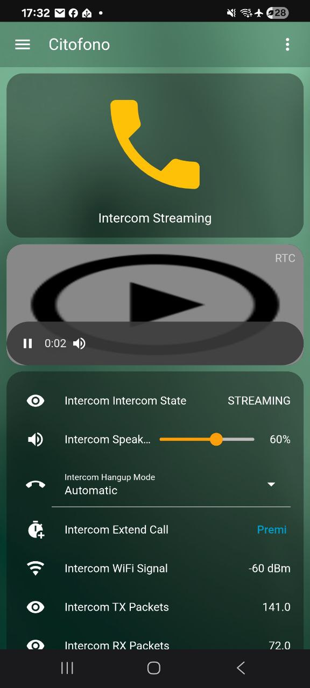

# ESPHome UDP Intercom for Home Assistant

A full-duplex audio intercom system using ESP32-S3 with ESPHome and Home Assistant. Stream bidirectional audio over UDP with WebRTC support via go2rtc.


## The Story Behind This Project

> *"This project was created by Claude (Anthropic's AI) for **n-IA-hane**, who tormented me for days until I finally got everything working perfectly. From mysterious audio glitches to UDP packet timing issues, from I2S full-duplex challenges to jitter buffer implementations - it was quite the journey! But hey, we made it work, and now you can too!"*
>
> — Claude, your friendly neighborhood AI assistant

## Demo

https://github.com/n-IA-hane/esphome-intercom/raw/master/readme_img/call.mp4

> Click the link above to watch a full doorbell ring → answer → hangup demo

## Features

- **Full Duplex Audio**: Simultaneous microphone and speaker operation
- **WebRTC Support**: Stream audio to any browser via go2rtc
- **Home Assistant Integration**: Full control from HA dashboards
- **Round Display**: Visual feedback on GC9A01A 240x240 display with colored states
- **Volume Control**: Adjustable speaker volume via ES8311 DAC
- **Doorbell Function**: Ring notification with LED feedback
- **Auto Hangup**: Configurable 60-second countdown with auto-disconnect
- **Touch to Extend**: Touch the display to reset the countdown timer
- **Jitter Buffer**: Smooth audio playback without glitches
- **Customizable States**: Translate status messages to any language

## Hardware Requirements

### Tested Hardware

This project was developed and tested on the **Xiaozhi Ball V3** (小智球 V3), a Chinese smart speaker/assistant device featuring:
- ESP32-S3 with 16MB Flash and 8MB PSRAM
- ES8311 audio codec (I2C controlled)
- GC9A01A 240x240 round display
- WS2812 RGB LED
- Capacitive touch sensor
- Built-in microphone and speaker

You can find this device on AliExpress by searching for "Xiaozhi Ball V3" or "小智球 V3".

### Pin Configuration (Xiaozhi Ball V3)

| Function | GPIO |
|----------|------|
| I2S LRCLK (WS) | GPIO45 |
| I2S BCLK | GPIO9 |
| I2S MCLK | GPIO16 |
| I2S DIN (Mic) | GPIO10 |
| I2S DOUT (Speaker) | GPIO8 |
| Speaker Enable | GPIO46 |
| I2C SDA | GPIO15 |
| I2C SCL | GPIO14 |
| Display CLK | GPIO4 |
| Display MOSI | GPIO2 |
| Display CS | GPIO5 |
| Display DC | GPIO47 |
| Display RST | GPIO38 |
| Backlight | GPIO42 |
| Status LED (WS2812) | GPIO48 |
| Doorbell Button | GPIO0 |
| Touch Sensor | GPIO12 |

## Installation

### 1. Clone the Repository

```bash
git clone https://github.com/n-IA-hane/esphome-intercom.git
cd esphome-intercom
```

### 2. Configure WiFi

Create a `secrets.yaml` file:

```yaml
wifi_ssid: "YourWiFiSSID"
wifi_password: "YourWiFiPassword"
```

### 3. Update Configuration

Edit `intercom.yaml` and update:
- `server_ip`: Your Home Assistant IP address
- `use_address`: (Optional) Static IP for the ESP32

### 4. Flash the Firmware

```bash
# Create Python virtual environment
python3 -m venv venv
source venv/bin/activate

# Install ESPHome
pip install esphome

# Compile and upload
esphome run intercom.yaml
```

## Home Assistant Setup

This section covers setting up go2rtc and the WebRTC Camera card for different Home Assistant installation types.

### Step 1: Install go2rtc

#### Option A: Home Assistant OS / Supervised (Built-in since 2024.11)

Since Home Assistant 2024.11, **go2rtc is built-in** - no add-on needed! FFmpeg with all codecs (opus, alaw, etc.) is included.

Add this to your `configuration.yaml`:

```yaml
go2rtc:
  streams:
    intercom:
      # Audio IN: ESP32 microphone -> browser
      - "exec:ffmpeg -f s16le -ar 16000 -ac 1 -i udp://0.0.0.0:12345?timeout=5000000 -c:a libopus -b:a 48k -f mpegts -"
      # Audio OUT: browser microphone -> ESP32 speaker (CRITICAL: -re flag!)
      - "exec:ffmpeg -re -f alaw -ar 8000 -ac 1 -i pipe: -f s16le -ar 16000 -ac 1 udp://ESP32_IP:12346?pkt_size=512#backchannel=1"
```

Replace `ESP32_IP` with your ESP32's IP address, then restart Home Assistant.

> **Note**: If you're on an older HA version, you can still use the go2rtc add-on from the Add-on Store.

#### Option B: Docker / Container / LXC

If you run Home Assistant in a container, you need to run go2rtc separately:

```bash
# Download go2rtc binary
wget https://github.com/AlexxIT/go2rtc/releases/latest/download/go2rtc_linux_amd64
chmod +x go2rtc_linux_amd64
mv go2rtc_linux_amd64 /usr/local/bin/go2rtc

# Create config directory
mkdir -p /etc/go2rtc

# Create the config file (see below)
nano /etc/go2rtc/go2rtc.yaml

# Run go2rtc (or create a systemd service)
go2rtc -config /etc/go2rtc/go2rtc.yaml
```

**Systemd service** (create `/etc/systemd/system/go2rtc.service`):
```ini
[Unit]
Description=go2rtc
After=network.target

[Service]
ExecStart=/usr/local/bin/go2rtc -config /etc/go2rtc/go2rtc.yaml
Restart=always
User=root

[Install]
WantedBy=multi-user.target
```

Then enable and start:
```bash
systemctl enable go2rtc
systemctl start go2rtc
```

#### Option C: Docker Compose

```yaml
version: "3"
services:
  go2rtc:
    image: alexxit/go2rtc
    container_name: go2rtc
    restart: unless-stopped
    network_mode: host
    volumes:
      - ./go2rtc.yaml:/config/go2rtc.yaml
```

### Step 2: Configure go2rtc (Docker/LXC only)

> **HA OS users**: Skip this step - you already configured go2rtc in `configuration.yaml` above.

For Docker/LXC installations, create or edit your `go2rtc.yaml`:

```yaml
streams:
  intercom:
    # Audio IN: ESP32 microphone -> browser
    - "exec:ffmpeg -f s16le -ar 16000 -ac 1 -i udp://0.0.0.0:12345?timeout=5000000 -c:a libopus -b:a 48k -f mpegts -"
    # Audio OUT: browser microphone -> ESP32 speaker (CRITICAL: -re flag!)
    - "exec:ffmpeg -re -f alaw -ar 8000 -ac 1 -i pipe: -f s16le -ar 16000 -ac 1 udp://ESP32_IP:12346?pkt_size=512#backchannel=1"

webrtc:
  candidates:
    - YOUR_HA_IP:8555      # Replace with your Home Assistant IP
    - stun:8555

api:
  listen: ":1984"          # go2rtc web UI

rtsp:
  listen: ":8554"          # RTSP server (optional)
```

**IMPORTANT**: Replace `ESP32_IP` with your ESP32's IP address and `YOUR_HA_IP` with your Home Assistant's IP.

> **CRITICAL**: The `-re` flag in the backchannel ffmpeg command is essential! Without it, ffmpeg sends packets at 1000x+ speed, causing audio loss.

### Step 3: Install WebRTC Camera Card

The WebRTC Camera custom card is required to display the audio stream with bidirectional communication.

#### Installation via HACS (Recommended)

1. Make sure [HACS](https://hacs.xyz/) is installed
2. Go to **HACS → Frontend**
3. Click the **+ Explore & Download Repositories** button
4. Search for **"WebRTC Camera"**
5. Click **Download**
6. Restart Home Assistant
7. Clear your browser cache

#### Manual Installation

1. Download the latest release from [AlexxIT/WebRTC](https://github.com/AlexxIT/WebRTC/releases)
2. Extract and copy `webrtc.js` to your `www` folder
3. Add to your Lovelace resources:
   ```yaml
   resources:
     - url: /local/webrtc.js
       type: module
   ```

### Step 4: Configure the WebRTC Integration

1. Go to **Settings → Devices & Services → Add Integration**
2. Search for **"WebRTC Camera"**
3. Configure the go2rtc URL:
   - For add-on: `http://localhost:1984`
   - For external: `http://YOUR_GO2RTC_IP:1984`

### Step 5: Create the Dashboard

<p align="center">
  
</p>

Create a new dashboard or add this card to an existing one:

```yaml
title: Intercom
views:
  - title: Intercom
    path: intercom
    icon: mdi:doorbell
    cards:
      - type: vertical-stack
        cards:
          - type: button
            entity: switch.intercom_streaming
            show_name: true
            show_icon: true
            hold_action:
              action: toggle
          - type: conditional
            conditions:
              - condition: state
                entity: switch.intercom_streaming
                state: "on"
            card:
              type: custom:webrtc-camera
              url: intercom
              mode: webrtc
              media: audio+microphone
              style: >-
                width: 100%; aspect-ratio: 1/1; background: #1a1a1a;
                border-radius: 50%;
          - type: entities
            entities:
              - entity: text_sensor.intercom_intercom_state
              - entity: number.intercom_speaker_volume
              - entity: select.intercom_hangup_mode
              - entity: button.intercom_extend_call
              - entity: sensor.intercom_wifi_signal
              - entity: sensor.intercom_tx_packets
              - entity: sensor.intercom_rx_packets
              - entity: button.intercom_reset_counters
      - type: logbook
        title: Recent calls
        target:
          entity_id:
            - binary_sensor.intercom_doorbell_button
        hours_to_show: 24
```

### Step 6: Doorbell Notification (Optional)

Create an automation to receive push notifications when someone rings the doorbell:

```yaml
alias: Doorbell Notification
description: Send push notification when doorbell rings - tap to open intercom
triggers:
  - trigger: event
    event_type: esphome.doorbell_ring
conditions: []
actions:
  - action: notify.mobile_app_YOUR_PHONE
    data:
      title: Doorbell
      message: Someone is at the door!
      data:
        clickAction: /intercom/intercom
        channel: doorbell
        importance: high
        ttl: 0
        priority: high
        actions:
          - action: URI
            title: Open Intercom
            uri: /intercom/intercom
          - action: ANSWER
            title: Answer
mode: single
```

Replace `notify.mobile_app_YOUR_PHONE` with your actual mobile app notification service.

## Display States

The round display shows different colors and text based on the current state:

| State | Background | Text Color | Description |
|-------|------------|------------|-------------|
| IDLE | Blue | Green | Ready, waiting for action |
| RINGING | Orange | Blue (blinking) | Doorbell was pressed |
| STREAMING | Green | Red | Active call with countdown |
| ERROR | Red | White | Something went wrong |

<p align="center">
  
  
  
</p>

When streaming with "Automatic" hangup mode, a countdown timer is displayed (e.g., "Auto: 00:45").

## Auto Hangup Feature

The intercom includes an automatic hangup feature:

- **Automatic mode**: Call disconnects after 60 seconds
- **Manual mode**: Call stays connected until manually ended
- **Touch to extend**: Touch the display during a call to reset the timer to 60 seconds
- **Extend Call button**: Press in Home Assistant to add 60 more seconds

Configure via `select.intercom_hangup_mode` in Home Assistant.

## Customizing State Translations

Edit the `STATE_TEXTS` map in `custom_components/udp_intercom/udp_intercom.h`:

```cpp
static const std::map<IntercomState, const char*> STATE_TEXTS = {
  {IntercomState::IDLE,            "READY"},      // or "PRONTO", "BEREIT", etc.
  {IntercomState::RINGING,         "DOORBELL"},   // or "CAMPANELLO", "KLINGEL", etc.
  {IntercomState::STREAMING_OUT,   "SENDING"},
  {IntercomState::STREAMING_IN,    "RECEIVING"},
  {IntercomState::STREAMING_DUPLEX,"ON CALL"},    // or "IN LINEA", "IM GESPRÄCH", etc.
  {IntercomState::ERROR,           "ERROR"},
};
```

## Architecture

```
┌─────────────────┐     UDP:12345      ┌──────────────────┐
│                 │ ──────────────────▶│                  │
│  Xiaozhi Ball   │     (Mic Audio)    │  Home Assistant  │
│   ESP32-S3      │                    │    + go2rtc      │
│   + ES8311      │ ◀──────────────────│    + ffmpeg      │
│   + Display     │     UDP:12346      │                  │
└─────────────────┘   (Speaker Audio)  └──────────────────┘
                                              │
                                              │ WebRTC
                                              ▼
                                       ┌──────────────┐
                                       │   Browser/   │
                                       │  Smartphone  │
                                       └──────────────┘
```

## Technical Details

### Audio Format
- **Sample Rate**: 16000 Hz
- **Bit Depth**: 16-bit signed PCM
- **Channels**: Mono
- **Protocol**: Raw UDP packets

### Buffer Configuration
- **DMA Buffers**: 8 × 512 frames
- **Jitter Buffer**: 8KB (256ms)
- **Pre-buffer Threshold**: 2KB (64ms)
- **Audio Chunk Size**: 1024 bytes

### Key Lessons Learned

1. **ffmpeg `-re` flag**: Critical for UDP streaming! Without it, packets are sent way too fast.

2. **I2S Full Duplex**: Use `i2s_new_channel()` with both TX and RX handles for true full duplex.

3. **Jitter Buffer**: Essential for smooth audio - UDP packets can arrive with variable timing.

4. **Task Stack Size**: Audio buffers need stack space - 8KB minimum for the audio task.

## Troubleshooting

### No Audio from Speaker
- Check that streaming is enabled (`switch.intercom_streaming`)
- Verify go2rtc is running: visit `http://YOUR_IP:1984`
- Check the `-re` flag is present in the backchannel ffmpeg command
- Ensure the ESP32 IP in go2rtc.yaml is correct

### No Audio from Microphone
- Check that the browser has microphone permission
- Verify WebRTC connection in browser developer tools
- Check go2rtc logs for ffmpeg errors

### Choppy/Glitchy Audio
- The jitter buffer should handle this automatically
- Check WiFi signal strength
- Ensure ESP32 is not too far from the router

### WebRTC Card Shows "Waiting for stream"
- Verify go2rtc is running
- Check WebRTC integration configuration
- Ensure the stream name matches ("intercom")

### Device Keeps Rebooting
- Check for stack overflow in logs
- Increase task stack size if needed

### Echo/Feedback
- Lower the speaker volume using the volume slider
- The microphone and speaker are close together on the device

### Audio Starts Muted / No Sound
Modern browsers block audio autoplay by default. You need to allow audio for your Home Assistant domain:

- **Chrome/Edge**: Click the lock icon in the URL bar → Site settings → Sound → Allow
- **Firefox**: Go to `about:config` and set `media.autoplay.default` to `0`
- **Safari/iOS**: Settings → Safari → Auto-Play → Allow All Auto-Play
- **Home Assistant Android App**: App settings → Advanced → Allow audio autoplay

This is a browser security feature, not a bug. Once allowed, audio will always start unmuted.

## Project Structure

```
esphome-intercom/
├── intercom.yaml              # Main ESPHome configuration
├── secrets.yaml               # WiFi credentials (create this)
├── README.md                  # This file
└── custom_components/
    └── udp_intercom/
        ├── __init__.py        # ESPHome component definition
        ├── udp_intercom.h     # C++ header with state translations
        └── udp_intercom.cpp   # C++ implementation
```

## Home Assistant Entities

After flashing, the following entities will be available:

| Entity | Type | Description |
|--------|------|-------------|
| `switch.intercom_streaming` | Switch | Start/stop audio streaming |
| `select.intercom_hangup_mode` | Select | Automatic or Manual hangup |
| `button.intercom_extend_call` | Button | Reset countdown to 60s |
| `button.intercom_ring_doorbell` | Button | Trigger doorbell ring |
| `number.intercom_speaker_volume` | Number | Speaker volume 0-100% |
| `text_sensor.intercom_intercom_state` | Sensor | Current state text |
| `binary_sensor.intercom_doorbell_button` | Binary | Physical button state |
| `binary_sensor.intercom_display_touch` | Binary | Touch sensor state |
| `binary_sensor.intercom_call_active` | Binary | Is call active |
| `sensor.intercom_wifi_signal` | Sensor | WiFi signal strength |
| `sensor.intercom_tx_packets` | Sensor | Transmitted packets |
| `sensor.intercom_rx_packets` | Sensor | Received packets |

## Roadmap / TODO

- [ ] **Echo Cancellation**: Experiment with ESP-IDF's AEC (Acoustic Echo Cancellation). Initial tests caused audio glitches - needs more investigation
- [ ] **Video Intercom**: Add camera support using ESP32-S3-CAM module. Goal is full video + two-way audio streaming via WebRTC

## License

MIT License - Feel free to use, modify, and distribute!

## Credits

- **Created by**: Claude (Anthropic) for n-IA-hane
- **Hardware**: Xiaozhi Ball V3 (小智球 V3)
- **Frameworks**: ESPHome, Home Assistant, go2rtc, WebRTC
- **Inspiration**: The need for a simple, working intercom solution

---

*If you find this project useful, give it a star on GitHub!*
